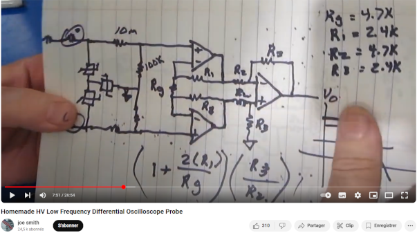

# CheapDifferentialProbe
Plans and calculations to build a cheap differential probe for amateur measurements. This designed is based on the explanations provided by Joe Smith in his tutorial video available here : [Homemade HV Low Frequency Differential Oscilloscope Probe](https://www.youtube.com/watch?v=_OZ5Xer84eo). In order to simplify the "copy" of that design I'll expose here my implementation of it. The idea is to stay way below (20$) the price of a commercial probe (150$) with the BOM. It has a lot of implications such as low performance, but these may be enough for the amateur electronician wanting to make some simple differential measurements.

While searching arrount I found this very well built probe and I'm going to take a lot of inspirations from it as well : [lbarbisch / Diff-Probe](https://github.com/lbarbisch/Diff-Probe)

It can be enhanced into different versions, but the point here is to keep it cheap and accessible, otherwise you would just have to buy a commercial version and spare the hassle of assempling one.

# The concept

The power supply is based on a 9V battery which will provide a symetrical power supply. An instrumenation amplifier made of 3 op amps will make the differential measurement such as exmplained in Joe Smith video. In order to achieve this an OpAmp will regulate the symetry of the power supply. This idea is desribed on [Electronics Stack Exchange here](https://electronics.stackexchange.com/questions/90136/symmetrical-power-supply-circuit). In the discussion on that thread a link is provided to a personal page detailling the operation of such a circuit [Virtual Ground Circuits](https://tangentsoft.com/elec/vgrounds.html)

The operational amplifier chosen is of the TL07x familly because they are easy to find and cheap. However they are low performance and one cannot expect to achieve really high bandwidths with it.

The instrumentation amplifier is made as described in the video, I strongly recoment to watch it in order to have a good understanding of it's operation and performance. In the video the schematic is well explained and the operation is demonstrated though a series of tests using low voltage and mains.

in order to achieve some reasonable frequency response we will use the capacitor compensation technique described here : [Voltage divider capacitive compensation](https://www.analog.com/en/resources/analog-dialogue/studentzone/studentzone-november-2018.html)

# Implementation

The implementation will be based on:
- TL0xx operational amplifier
- 1% resistors
- HV capacitors
- PTC and MOV for input surge protection
- Trimmable resistors to tune the circuit

A KiCad schematic and board is provided in this repository

## Assumptions on the components

I have resistors for which I do not know the voltage rating. I'll assume that they are rated for 200V each, the design aims to work on mains in Europe thus 230VAC RMS +/- 10% or a maximum peak value of 361Vpk let's say 400Vpk. I need to have, at bare minimum two resistors upfront.

# Building the probe on breadbord

## Testing the passive components

In order to have a relatively good probe, components such as resistors, capacitors and even the operation amplifier must be characterized and selected in order to achieve best operation. 

For that, the resistors and capacitors are going to be measured, sorted and selected in order to achieve : 
- The best possible symmetry in the circuit
- The best possible ratios between the components
- The best possible ratios between the resistor voltage divisor network and the capacitor divisor network

For that I use my cheap multimeter, which may not be calibrated, but offers some information anyway, and measure all the resistances and capacitors.

## Testing the operational amplifier

The operational amplifier are going to be checked in order to verify that I did not by rebranded inferior copies.

For that I'll make a simple follower circuit and test the output against a square input.

# Circuit on breadbord

# Building on circuit board

